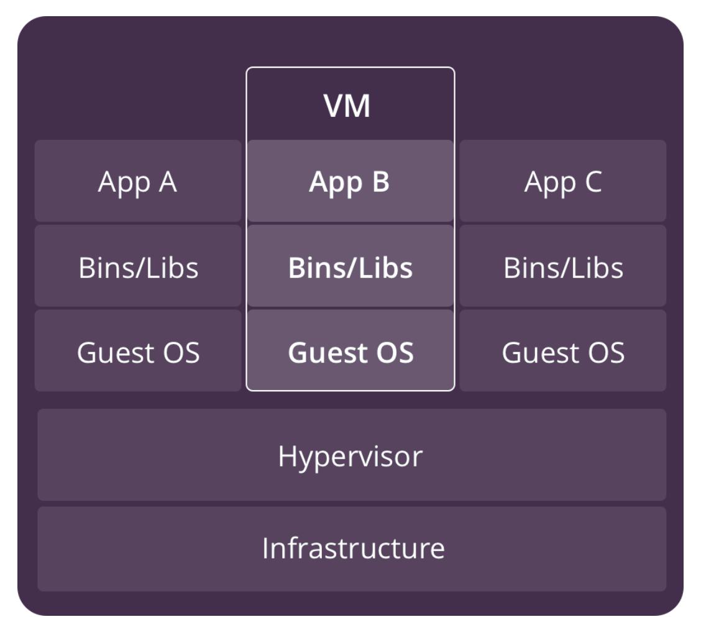
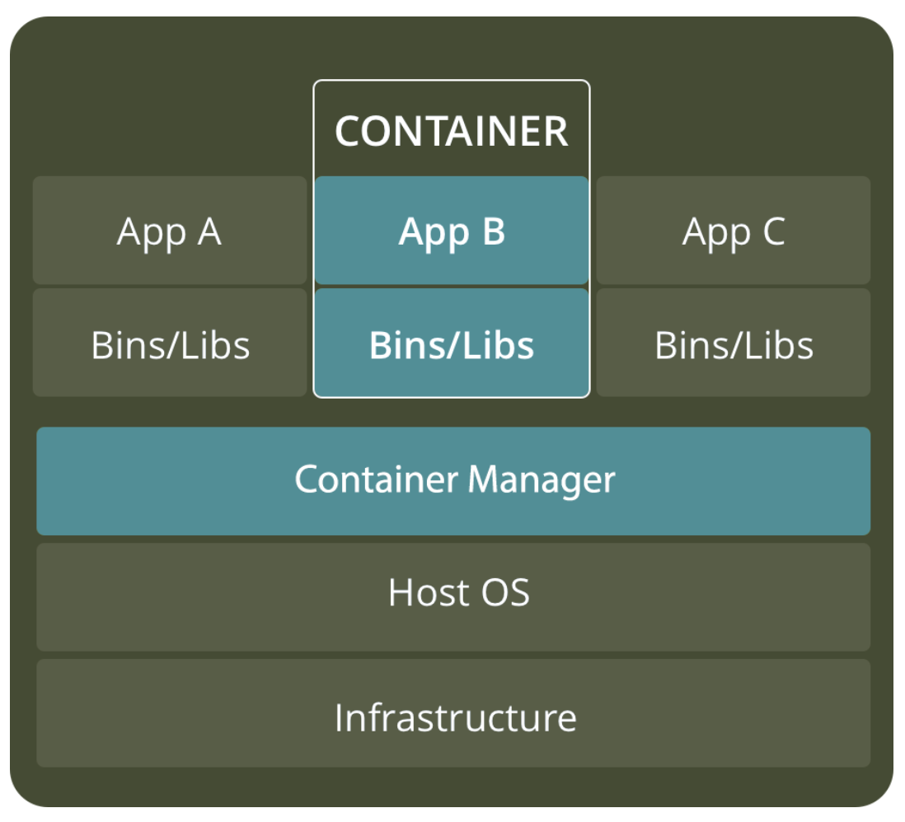
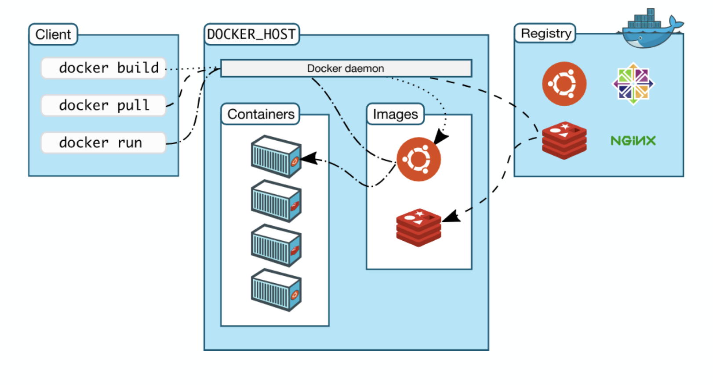

# Session 1 - Basics of Docker 🐋

### Virtual Machines vs Containerization

Similar goals:
* Both are virtualization strategies  
* Self-contained units that could run everywhere 
* To isolate an application and all its dependencies

A virtual machine (VM) is an emulation of a computer system. Put simply, it makes it possible to run what appear to be many separate computers on hardware that is actually one computer.

The operating systems and their applications share hardware resources from a single host server, or from a pool of host servers. Each VM requires its own underlying OS,and the hardware is virtualized. A hypervisor is software, firmware, or hardware that creates and runs VMs. It sits between the hardware and the virtual machine and is necessary to virtualize the server.



VMs are a better choice for running apps that require all of the operating system’s resources and functionality or when you need to run multiple applications on servers. Also they include established management and security tools.

Popular VM providers:
* [VMware vSphere](https://www.vmware.com/products/vsphere.html)
* [VirtualBox](https://www.virtualbox.org/)
* [Hyper-V](https://docs.microsoft.com/en-us/virtualization/hyper-v-on-windows/about/)

Containers, instead of virtualizing the underlying computer like a virtual machine, just the OS is virtualized.

Containers sit on top of a physical server and its host OS — typically Linux or Windows. Each container shares the host OS kernel and, usually, the binaries and libraries, too.  Sharing OS resources such as libraries significantly reduces the need to reproduce the operating system code, and means that a server can run multiple workloads with a single operating system installation. Containers are light — they are only megabytes in size and take just seconds to start.

In contrast to VMs, all that a container requires is an operating system, supporting programs and libraries, and system resources to run a specific program. What this means in practice is you can put two to three times as many as applications on a single server with containers than you can with a VM. In addition, with containers you can create a portable, consistent operating environment for development, testing, and deployment.



Containers are a better choice when your biggest priority is maximizing the number of applications running on a minimal number of servers.

Popular container provider:
*  [Linux Containers](https://linuxcontainers.org/)
*  [Docker](https://www.docker.com/)
*  [Windows Server Containers](https://docs.microsoft.com/en-us/virtualization/windowscontainers/about/)

### Docker

* Implementation of Containers Virtualization
* Layered file system - UnionFS
* Declarable volumes and network units
* Public registry (version control system system support)
* Community and Enterprise editions
* Integrated cluster manager (Docker Swarm / Kubernetes for Docker EE)

### Why Docker?

Less overhead - applications are rapidly deployed, patched and scaled

Portability - apps deployed easily to multiple different operating systems and hardware platforms

Consistent operations & environment - Docker provides tooling and a platform to manage the lifecycle of your containers in the same way, whether your environment is a local machine, in-house hosting or a cloud provider.

Isolation - Docker provides the ability to package and run an application in a loosely isolated environment called a container.

### DOCKER ARCHITECTURE

Client-Server architecture 

* Docker Daemon (Server)
* Docker Client (CLI) 
* Docker REST API
* Docker Registry

The Docker client and daemon can run on the same system, or you can connect a Docker client to a remote Docker daemon. The Docker client and daemon communicate using a REST API, over UNIX sockets or a network interface.



#### The Docker daemon
The Docker daemon listens for Docker API requests and manages Docker objects such as images, containers, networks, etc. A daemon can also communicate with other daemons.

```
docker info
```

```
docker events
docker run hello-world (in another terminal)
```

#### The Docker client
The Docker client is the primary way that many Docker users interact with Docker. When you use commands such as docker run, the client sends these commands to docker deamon, which carries them out. The docker command uses the Docker API. The Docker client can communicate with more than one daemon.

```
docker
```

#### Docker Image
An image is a read-only template with instructions for creating a Docker container

#### Docker Container
A container is an instance of an image

#### Docker registries
A Docker registry stores Docker images. Docker Hub is official public registry that anyone can use, and Docker is configured to look for images on Docker Hub by default. You can even run your own private registry.

Docker Trusted Registry (DTR) - commercial product, complete image management workflow, featuring LDAP integration, image signing, security scanning etc.

When you use the docker pull or docker run commands, the required images are pulled from your configured registry. When you use the docker push command, your image is pushed to your configured registry.


### Hello world

```
docker run hello-world
```

[Hello world on DockerHub](https://hub.docker.com/_/hello-world)

[Hello world source on GitHub](https://github.com/docker-library/hello-world/blob/master/hello.c)

### Building docker images

#### Dockerfile
Docker builds images automatically by reading the instructions from a Dockerfile -- a text file that contains all commands, in order, needed to build a given image.

A Docker image consists of layers each of which represents a Dockerfile instruction. The layers are stacked and each one is a delta of the changes from the previous layer.

    FROM node:12
    COPY . /app
    RUN make build
    CMD node /app/app.js

Each instruction creates one layer, so 4 layers are created in total on top of the node:12 image:

FROM creates a layer from the node:12 Docker image.
COPY adds files from your Docker client’s current directory.
RUN builds your application with make.
CMD specifies what command to run within the container when it starts.

When you run an image and generate a container, you add a new writable layer (the “container layer”) on top of the underlying layers. All changes made to the running container, such as writing new files, modifying existing files, and deleting files, are written to this thin writable container layer.

Now let's create a Dockerfile for our simple API server written in Node.js.

```
# ---- Base Node ----
FROM node:12 AS base
# Create app directory
WORKDIR /app

# ---- Dependencies ----
FROM base AS dependencies  
# A wildcard is used to ensure both package.json AND package-lock.json are copied
# WORKDIR /app
COPY ./package*.json ./
# install app dependencies including 'devDependencies'
RUN npm install

# ---- Copy Files/Build ----
FROM dependencies AS build  
# WORKDIR /app
# source code
COPY ./src /app/src/
# tests
COPY ./tests /app/tests/
# linter
COPY ./.eslintrc.js /app

# --- Release with Alpine ----
FROM node:12-slim AS release  
# Create app directory
WORKDIR /app
# Change file owner of /app to non root user defined in base image
RUN chown -R node:node /app
RUN chmod 755 /app
# Switch to non root user defined in base image
USER node
COPY --from=dependencies /app/package*.json ./
# Install app dependencies
RUN npm install --only=production
COPY --from=build /app ./
CMD ["node", "src/app.js"]
```

#### Base image (FROM)
A base image is the image which implies the image to build on top of. It refers to the contents of the FROM directive in the Dockerfile. Each subsequent declaration in the Dockerfile modifies this base image. 
There are various base images available (in different OS flavors). They usually contain specific OS setup and utilities.

#### AS
Enables to set a name for a build stage to be able to reference it.

#### WORKDIR
Sets working directory of a container

#### RUN
Runs command in a shell, which by default is `/bin/sh -c`

#### USER
By default, root in a container is the same root (uid 0) as on the host machine. If a user manages to break out of an application running as root in a container, he may be able to gain access to the host with the same root user.

#### COPY
Copies local files into the container. Ignores files listed in .dockerignore

#### CMD
Default executable in the container.
CMD ["node","app.js"]
NOTE: There can only be one CMD instruction in a Dockerfile. If you list more than one CMD, then only the last CMD will take effect.

### Image layers & cashing
```
docker build . -t hola-mundo-api
```

Change something in `src/app.js` and run docker build again.

### Push & Pull image from registry
